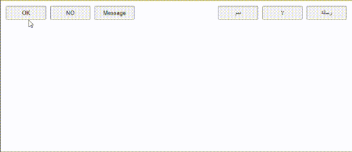

# toast-msg component


This is a toast-msg component: developers could create several toast messages. They will appear stacked on top of each other, and they will disappear automatically after a certain amount of time. It is a standard custom web component written in pure vanilla JS, so it could be used in any framework.

> With the package you will find a complete functional **example.html**<br>

## Usage:
Import the class of this component `ToastMsg`, then use its constructor to create a toast message:<br>
`const toast = new ToastMsg(content, msgTime, rtl);`
where:
- `content`: represents the content of the toast message.
   - could be a `boolean` type: if `true` => , if `false` => 
   - could be `undefined` (you do not pass anything): the same as if you pass `boolean true`
   - could be a `string`: you pass the message that you want to show.
- `msgTime`: the toast message, when appended to the document, will slid-in in 500 ms, will be shown for `msgTime` in ms (no-motion time), finally will slide-out in 500 ms:
   - could be a number to represent the no-motion time in ms.
   - could be `undefined`: in this case the no-motion time depends on the content of the message, and will be calculated according to this formula: `min(5000, max(500, 60 * content.length))` which means that the no-motion time will be proportional to the length of the message, but should never be outside the range [500, 5000] ms.
- `rtl`: Right-to-Left or Left-to-Right.
   - could be a `string`: `rtl` => the component will behave in a way compatible with Right-to-Left hand writing systems; it will slide-in from the right-hand side of the screen. For any other string value, the component will behave in a way compatible with Left-to-Right hand writing systems: it will slide-in from the left-hand side of the screen.
   - could be a `boolean` type: if `true` => as if passed the string `rtl`, if `false` => as if passed the string `ltr`.
   - could be `undefined` (you do not pass anything): the same as if you pass `boolean false`
   ```js
   import ToastMsg from "./toast-msg.js";

   document.body.appendChild(new ToastMsg());
   document.body.appendChild(new ToastMsg(false));
   document.body.appendChild(new ToastMsg(true, 1000));
   document.body.appendChild(new ToastMsg("any message"));
   document.body.appendChild(new ToastMsg("this message will appear from the right-hand side of the screen", "", "rtl"));
   ```

## Styling:
The component is simply a standard `div` element and you can reach it through `::part(container)`
   ```css
   ::part(container) { background-color: lightgray; }
   ```
